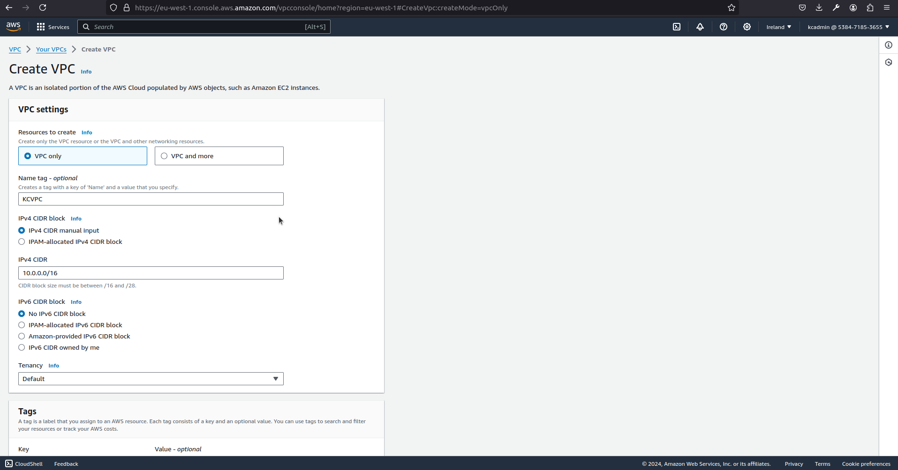
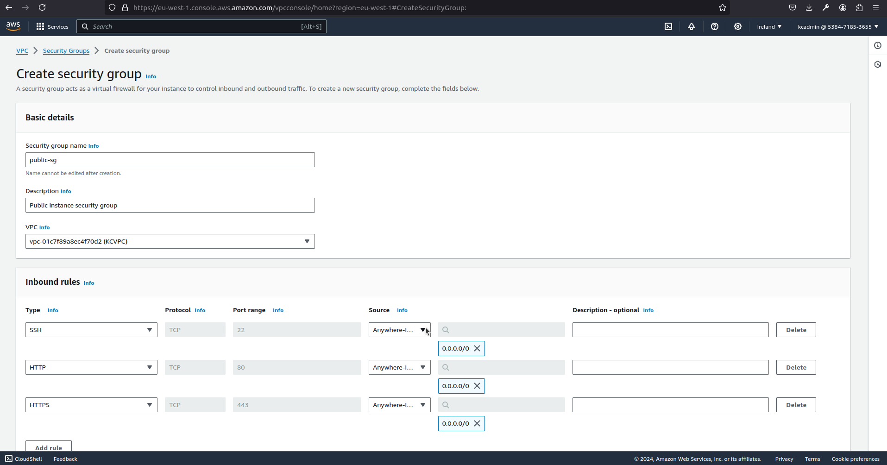

<!-- TABLE OF CONTENTS -->

  
Table of Contents

  <ol>
    <li>Objective</li>
    <li>Creation of VPC</li>
    <li>Creation of Subnets</li>
    <li>Creation of Internet Gateway</li>
    <li>Creation of Route Tables</li>
    <li>Creation of NAT Gateway</li>
    <li>Creation of Security Groups</li>
    <li>Creation of Network ACLs</li>
    <li>Deploy EC2 Instances</li>
    <li>Tests</li>
  </ol>

<!-- ABOUT THE PROJECT -->
## VIRTUAL PRIVATE CLOUD WITH BOTH PUBLIC AND PRIVATE SUBNETS

### Objective

Design and set up a Virtual Private Cloud (VPC) with both public and private subnets. Implement routing, security groups, and network access control lists (NACLs) to ensure proper communication and security within the VPC. Work in the AWS EU-West-1 (Ireland) region.

### Creation of VPC

From the dashboard, using the search console type VPC and proceed to the VPC page.
On the VPC page, click on the CREATE VPC button.
On the Create VPC page, input the following:

* Resources To Create field - select VPC only
* Name Tag field - type “KCVPC”
* IPV4 CIDR field - input “10.0.0.0/16”
Leave the other fields in their default and click on Create VPC to create the VPC

### Creation of Subnets

### Creation of Public Subnet
From the VPC dashboard, select the Subnets submenu on the left pane.
On the Subnet page, click on the CREATE SUBNET button.
On the Create Subnet page, input the following:

* VPC ID field - Select the KCVPC vpc.
* Subnet name field - type “PublicSubnet”
* Availability zone - select “eu-west-1a” (anyone is fine)
* IPV4 subnet CIDR block filed - input “10.0.1.0/24”

Leave the other fields in their default and click on Create Subnet to create the Subnet and associate with a specific VPC.

### Creation of Private Subnet
From the VPC dashboard, select the Subnets submenu on the left pane.
On the Subnet page, click on the CREATE SUBNET button.
On the Create Subnet page, input the following:

* VPC ID field - Select the KCVPC vpc.
* Subnet name field - type “PrivateSubnet”
* Availability zone - select “eu-west-1a” (anyone is fine)
* IPV4 subnet CIDR block filed - input “10.0.2.0/24”

Leave the other fields in their default and click on Create Subnet to create the Subnet and associate with a specific VPC.

### Creation of Internet Gateway
From the VPC dashboard, select the Internet gateways submenu on the left pane.
On the Internet Gateways page, click on the CREATE INTERNET GATEWAY button.
On the Create Internet Gateway page, input the following:

* Name Tag field - type “igw”.

Click on Create Internet Gateway to create the Internet gateway.

Afterwards, on the specific Internet gateway page (igw), click on the Actions drop down and select Attach To VPC.
On the Attach To VPC page, input the following:
* Available VPCs - select KCVPC vpc

Click on Attach Internet Gateway to attach the Internet gateway to a specific VPC.

### Creation of Route Tables

### Creation of Public Route Table
From the VPC dashboard, select the Route Tables submenu on the left pane.
On the Route Tables page, click on the CREATE ROUTE TABLE button.
On the Create Route Table page, input the following:

* Name Tag field - type “PublicRouteTable”.
* VPC ID field - Select the KCVPC vpc.

Click on Create Route Table.
To make the public Route table public, attach the Internet Gateway (igw) to it.

On the specific route table page, click on Edit Routes button.
On the Edit Routes, click on Add route button to enable entry of a new input row and input the following on the new row:
* Destination field - input “0.0.0.0/0”
* Target - select IGW internet gateway

Click on Save.

Attaching Subnet to the Route Table
On the Public route table page, click on Subnet associations.
Afterwards click on Edit Subnet Associations and select the Public subnet.

### Creation of Private Route Table
From the VPC dashboard, select the Route Tables submenu on the left pane.
On the Route Tables page, click on the CREATE ROUTE TABLE button.
On the Create Route Table page, input the following:

* Name Tag field - type “PrivateRouteTable”.
* VPC ID field - Select the KCVPC vpc.

Click on Create Route Table.

Attaching Subnet to the Route Table
On the Private route table page, click on Subnet associations.
Afterwards click on Edit Subnet Associations and select the Private subnet.

### Creation of NAT Gateway
From the VPC dashboard, select the NAT Gateway submenu on the left pane.
On the NAT Gateway page, click on the CREATE NAT GATEWAY button.
On the Create NAt Gateway page, input the following:

* Name Tag field - Name Tag field - type “kc-nat”.
* Subnet field - Select “Public Subnet”
* Connectivity type field - Select Public.
* Elastic IP allocation ID field - Choose an existing Elastic Ip or auto allocate one.

Click on Create NAT Gateway.

Attach the private route table to the NAT Gateway

On the private route table page, click on Edit Routes button.
On the Edit Routes, click on Add route button to enable entry of a new input row and input the following on the new row:
* Destination field - input “0.0.0.0/0”
* Target - select kc-nat NAT gateway

Click on Save.

### Creation of Security Groups

### Creation of Public Security Group
From the VPC dashboard, select the Security Group submenu on the left pane.
On the Security Group page, click on the CREATE SECURITY GROUP TABLE button.
On the Create Security Group page, input the following:

* Security Group Name field - type “public-sg”.
* Description field - type “public instance security group”
* VPC ID field - Select the KCVPC vpc.

On the Inbound Rules section
Click on Add Rule and copy the values in the image below:
Afterwards, click on Create

### Creation of Private Security Group
From the VPC dashboard, select the Security Group submenu on the left pane.
On the Security Group page, click on the CREATE SECURITY GROUP TABLE button.
On the Create Security Group page, input the following:
* Security Group Name field - type “private-sg”.
* Description field - type “private instance security group”
* VPC ID field - Select the KCVPC vpc.

On the Inbound Rules section
Click on Add Rule and copy the values in the image below:
Afterwards, click on Create

### Creation of Network ACLs

### Creation of Public Network ACL
From the VPC dashboard, select the Network ACL submenu on the left pane.
On the Network ACL page, click on the NETWORK ACL button.
On the Create Network ACL page, input the following:
* Name field - type “public-nacl”.
* VPC field - Select the KCVPC vpc.

Click on Create.

On the Inbound Rules section
Click on Add New Rule and copy the values in the image below:
Afterwards, click on Save.

Associate the Public NACL to the Public Subnet.

### Creation of Private Network ACL
From the VPC dashboard, select the Security Group submenu on the left pane.
On the Security Group page, click on the CREATE SECURITY GROUP TABLE button.
On the Create Security Group page, input the following:
* Security Group Name field - type “private-sg”.
* Description field - type “private instance security group”
* VPC ID field - Select the KCVPC vpc.

On the Inbound Rules section
Click on Add New Rule and copy the values in the image below:
Afterwards, click on Save.

Associate the Private NACL to the Private Subnet

### Deploy EC2 Instances

### Public Instance
From the EC2 dashboard, click on Launch Instances.
On the Launch Instance page, input the following:

* Name field - type “public-svr”.
* Application and OS Images - select Ubuntu
* Instance type - select t2.micro
* Key pair - generate a key pair

In Network Settings
* VPC ID field - Select the KCVPC vpc.
* Auto-assign public IP field - select Enable.
* Security group - select the “public-sg”

Click on Launch Instance

From the EC2 dashboard, click on Launch Instances.
On the Launch Instance page, input the following:

### Private Instance
Take the same steps for the Private Instance with the following changes:
* Name field - type “private-svr”.
* Application and OS Images - select Ubuntu
* Instance type - select t2.micro
* Key pair - generate a key pair

In Network Settings
* VPC ID field - Select the KCVPC vpc.
* Auto-assign public IP field - select Disable.
* Security group - select the “private-sg”

Click on Launch Instance

### TEST

Log into Public Server and ping Google.com and Private Server

Log into Private Server from Public Server and  ping Google.com and Publoc Server

