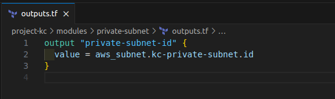
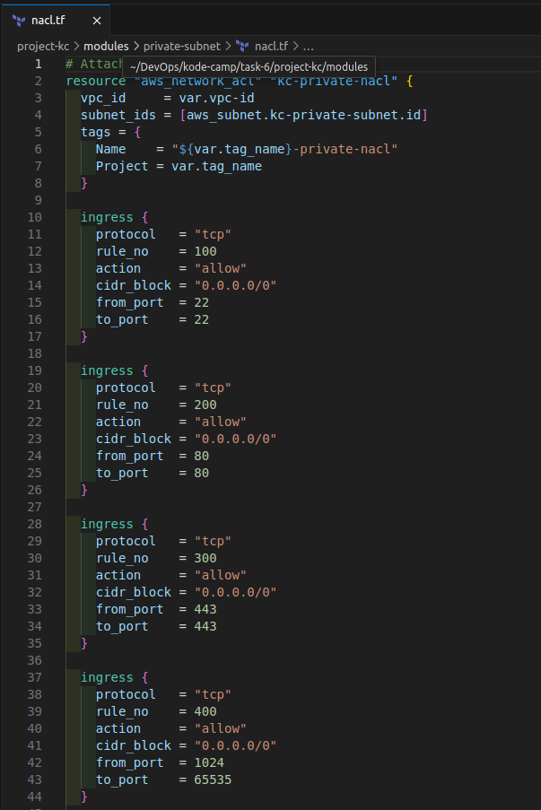

<!-- TABLE OF CONTENTS -->

  
Table of Contents

  <ol>
    <li>Objective</li>
    <li>Creation of VPC Module</li>
    <li>Creation of Public Subnet Module</li>
    <li>Creation of Private Subnet Module</li>
    <li>Creation of Public EC2 Module</li>
    <li>Creation of Private EC2 Module</li>
    <li>Creation of Root Module</li>
    <li>Creation of Setup Script</li>
    <li>Tests</li>
  </ol>

<!-- ABOUT THE PROJECT -->
## VIRTUAL PRIVATE CLOUD WITH BOTH PUBLIC AND PRIVATE SUBNETS USING TERRAFORM

### Objective

Using terraform and terraform modules, design and set up a Virtual Private Cloud (VPC) with both public and private subnets. Implement routing, security groups, and network access control lists (NACLs) to ensure proper communication and security within the VPC. Work in the AWS EU-West-1 (Ireland) region. Deploy Nginx and PostgreSQL on a public server in the public subnet.

********************************************************

### Creation of a Module folder

Within the root of the project folder, create a folder named **modules** to hold all the non root modules.

********************************************************

### Creation of VPC Module

This module will handle the creation of a VPC.
Create a folder named **vpc** within the **modules** folder. Within the folder create the following files:

* **main.tf**
Do the following within this file:

* **Creation of the vpc**.
  * Create a resource block of type **aws_vpc** with a name **kc-vpc**
  * Add the following attributes to the above resource block
    * A **cidr_block** to indicate the CIDR block.
    * A **tags** map with attributes of Name and Project.
  * Attributes with values having a **var** prefix will get their values from the **variable.tf** file.

* **variables.tf**
Do the following within this file:
  * Create the following variables blocks to hold variables required in **main.tf**.
    * A **vpc_cidr** to indicate the CIDR block
    * A **tag_name** to indicate the project metadata

* **outputs.tf**
Do the following within this file:
  * Create the following output blocks to hold output values that will be required in the subnet modules.

    * A **vpc-id** to hold the id of the created vpc

********************************************************

### Creation of Public Subnet Module

This module will handle the following:
* Creation of a public subnet.
* Creation of an internet gateway.
* Creation of a public route table.
* Association of the public route table to the public subnet.
* Creation of public network acl and association to a public subnet.

Create a folder named **public-subnet** within the **modules** folder. Within the folder create the following files:

* **main.tf**
Do the following within this file:

  * **Creation of the public subnet**.
    * Create a resource block of type **aws_subnet** with a name **kc-public-subnet**
    * Add the following attributes to the **aws_subnet** resource block
      * A **vpc_id** to indicate the id of the vpc.
      * A **cidr_block** to indicate the CIDR block.
      * A **availability_zone** to indicate the availability zone.
      * A **tags** map with attributes of Name and Project.

  * **Creation of an internet gateway**.
    * Create a resource block of type **aws_internet_gateway** with a name **kc-igw**
    * Add the following attributes to the **aws_internet_gateway** resource block
      * A **vpc_id** to indicate the id of the vpc.

  * **Creation of a public route table**.
    * Create a resource block of type **aws_route_table** with a name **PublicRouteTable**
    * Add the following attributes to the **aws_route_table** resource block
      * A **vpc_id** to indicate the id of the vpc
      * A **route** map that contains the following:
        * A **cidr_block** to indicate the CIDR block.
        * A **gateway_id** to indicate the internet gateway.
      * A **tags** map with attributes of Name and Project.

  * **Association of the public route table to the public subnet**.
    * Create a resource block of type **aws_route_table_association** with a name **kc-public-rtb-association**
    * Add the following attributes to the **aws_route_table_association** resource block
      * A **subnet_id** to indicate the id of the subnet.
      * A **route_table_id** to indicate the id of the route table.
    
Attributes with values having a **var** prefix will get their values from the **variable.tf** file.

* **variables.tf**
Do the following within this file:
  * Create the following variables blocks to hold variables required in **main.tf**.
    * A **vpc_cidr** to indicate the CIDR block.
    * A **subnet_cidr** to indicate the CIDR block.
    * A **subnet-availability-zone** to indicate the availability zone.
    * A **tag_name** to indicate the project metadata.

* **outputs.tf**
Do the following within this file:
  * Create the following output blocks to hold output values that will be required in the **private subnet and public ec2** modules.

    * A **public-subnet-id** to hold the id of the created subnet.

* **nacl.tf**
Do the following within this file:
* **Creation of public network acl and association to a public subnet**.
  * Create a resource block of type **aws_network_acl** with a name **kc-public-nacl**.
  * Add the following attributes to the **aws_network_acl** resource block
    * A **vpc_cidr** to indicate the CIDR block.
    * A **subnet_id** to indicate the subnet id.
    * A **tags** map with attributes of Name and Project.
    * Ingress and egress maps.

Attributes with values having a **var** prefix will get their values from the **variable.tf** file.

********************************************************

### Creation of Private Subnet Module

This module will handle the following:
* Creation of a private subnet.
* Creation of an elastic ip.
* Creation of a nat gateway.
* Creation of a private route table.
* Association of the private route table to the private subnet.
* Creation of private network acl and association to a private subnet.

Create a folder named **private-subnet** within the **modules** folder. Within the folder create the following files:

* **main.tf**
Do the following within this file:

  * **Creation of the private subnet**.
    * Create a resource block of type **aws_subnet** with a name **kc-private-subnet**
    * Add the following attributes to the **aws_subnet** resource block
      * A **vpc_id** to indicate the id of the vpc.
      * A **cidr_block** to indicate the CIDR block.
      * A **availability_zone** to indicate the availability zone.
      * zA **tags** map with attributes of Name and Project.

  * **Creation of an elastic ip**.
    * Create a resource block of type **aws_eip** with a name **kc-eip**
    * Add the following attributes to the **aws_eip** resource block
      * A **domain** to indicate that the elastic ip is for use in VPC.
      * A **tags** map with attributes of Name and Project.

  * **Creation of a nat gateway**.
    * Create a resource block of type **aws_nat_gateway** with a name **kc-nat**
    * Add the following attributes to the **aws_nat_gateway** resource block
      * A **depends_on** to indicate the elastic ip component to be created before the association to the nat gateway.
      * An **allocation_id** to indicate the allocation id of the elastic ip address.
      * A **subnet_id** to indicate the id of the subnet.
      * A **tags** map with attributes of Name and Project.

  * **Creation of a private route table**.
    * Create a resource block of type **aws_route_table** with a name **PrivateRouteTable**
    * Add the following attributes to the **aws_route_table** resource block
      * A **vpc_id** to indicate the id of the vpc.
      * A **depends_on** to indicate the nat gateway component to be created before the association to the route table.
      * A **route** map that contains the following:
        * A **cidr_block** to indicate the CIDR block.
        * A **nat_gateway_id** to indicate the nat gateway.
      * A **tags** map with attributes of Name and Project.

  * **Association of the private route table to the private subnet**.
    * Create a resource block of type **aws_route_table_association** with a name **kc-private-rtb-association**
    * Add the following attributes to the **aws_route_table_association** resource block
      * A **subnet_id** to indicate the id of the subnet.
      * A **route_table_id** to indicate the id of the route table.
    
Attributes with values having a **var** prefix will get their values from the **variable.tf** file.

* **variables.tf**
Do the following within this file:
  * Create the following variables blocks to hold variables required in **main.tf**.
    * A **vpc_cidr** to indicate the CIDR block.
    * A **subnet_cidr** to indicate the CIDR block.
    * A **subnet-availability-zone** to indicate the availability zone.
    * A **public-subnet-id** to indicate the id of the public subnet.
    * A **tag_name** to indicate the project metadata.

* **outputs.tf**
Do the following within this file:
  * Create the following output blocks to hold output values that will be required in the **private ec2** modules.

    * A **private-subnet-id** to hold the id of the created subnet.

* **nacl.tf**
Do the following within this file:
* **Creation of private network acl and association to a private subnet**.
  * Create a resource block of type **aws_network_acl** with a name **kc-private-nacl**.
  * Add the following attributes to the **aws_network_acl** resource block
    * A **vpc_cidr** to indicate the CIDR block.
    * A **subnet_id** to indicate the subnet id.
    * A **tags** map with attributes of Name and Project.
    * Ingress and egress maps.

Attributes with values having a **var** prefix will get their values from the **variable.tf** file.

********************************************************

### Creation of Public EC2 Module

This module will handle the following:
* Creation of a public ec2 instance.
* Creation of a public security group.
* Creation of a public security group rules.

Create a folder named **public-ec2** within the **modules** folder. Within the folder create the following files:

* **main.tf**
Do the following within this file:

  * **Creation of the public ec2 instance**.
    * Create a resource block of type **aws_instance** with a name **kc-public-ec2**
    * Add the following attributes to the **aws_instance** resource block
      * A **ami** to indicate the id of the ami.
      * An **associate_public_ip_address** to associate a public ip address with the instance.
      * An **instance_type** to indicate the instance type.
      * A **subnet_id** to indicate the id of the subnet.
      * A **route_block_device** map that contains the following:
        * A **delete_on_termination** to indicate if the volume should be destroyed when the instance is terminated.
        * A **volume_size** to indicate size of the volume.
        * A **volume_type** to indicate the type of the volume.
      * A **key_name** to indicate the key name.
      * A **vpc_security_group_ids** to indicate id of the security group.
      * A **user_data** to load a script.
      * A **tags** map with attributes of Name and Project.

  * **Creation of a public security group**.
    * Create a resource block of type **aws_security_group** with a name **kc-public-sg**
    * Add the following attributes to the **aws_security_group** resource block
      * A **vpc_id** to indicate the id of the vpc.
      * A **tags** map with attributes of Name and Project.

  * **Creation of a public security group rules**.
    * Create a list of rules of type **aws_vpc_security_group_ingress_rule** and **aws_vpc_security_group_egress_rule**.
    
Attributes with values having a **var** prefix will get their values from the **variable.tf** file.

* **variables.tf**
Do the following within this file:
  * Create the following variables blocks to hold variables required in **main.tf**.
    * A **vpc-id** to indicate the id of the vpc.
    * A **ami-id** to indicate the id of the ami.
    * A **ec2-type** to indicate the instance type.
    * A **subnet-id** to indicate the id of the subnet.
    * A **aws-key** to indicate the aws key.
    * A **tag_name** to indicate the project metadata.

********************************************************

## Creation of Private EC2 Module

This module will handle the following:
* Creation of a private ec2 instance.
* Creation of a private security group.
* Creation of a private security group rules.

Create a folder named **private-ec2** within the **modules** folder. Within the folder create the following files:

* **main.tf**
Do the following within this file:

  * **Creation of the private ec2 instance**.
    * Create a resource block of type **aws_instance** with a name **kc-private-ec2**
    * Add the following attributes to the **aws_instance** resource block
      * A **ami** to indicate the id of the ami.
      * An **instance_type** to indicate the instance type.
      * A **subnet_id** to indicate the id of the subnet.
      * A **route_block_device** map that contains the following:
        * A **delete_on_termination** to indicate if the volume should be destroyed when the instance is terminated.
        * A **volume_size** to indicate size of the volume.
        * A **volume_type** to indicate the type of the volume.
      * A **key_name** to indicate the key name.
      * A **vpc_security_group_ids** to indicate id of the security group.
      * A **tags** map with attributes of Name and Project.

  * **Creation of a private security group**.
    * Create a resource block of type **aws_security_group** with a name **kc-private-sg**
    * Add the following attributes to the **aws_security_group** resource block
      * A **vpc_id** to indicate the id of the vpc.
      * A **tags** map with attributes of Name and Project.

  * **Creation of a private security group rules**.
    * Create a list of rules of type **aws_vpc_security_group_ingress_rule** and **aws_vpc_security_group_egress_rule**.
    
Attributes with values having a **var** prefix will get their values from the **variable.tf** file.

* **variables.tf**
Do the following within this file:
  * Create the following variables blocks to hold variables required in **main.tf**.
    * A **vpc-id** to indicate the id of the vpc.
    * A **ami-id** to indicate the id of the ami.
    * A **ec2-type** to indicate the instance type.
    * A **subnet-id** to indicate the id of the subnet.
    * A **aws-key** to indicate the aws key.
    * A **tag_name** to indicate the project metadata.

********************************************************

### Creation of Root Module

This module will handle the following:
* Declare the AWS provider.
* Call the VPC module.
* Call the Public subnet module.
* Call the Private subnet module.
* Call the Public ec2 module.
* Call the Private ec2 module.

Within the project root folder create the following files:

* **main.tf**
Do the following within this file:

  * **Declare the AWS provider**.
    * Create a provider block of type **aws**.
    * Add the following attributes to the **aws** provider block
      * A **region** to indicate the region.
      * An **access_key** to indicate the access key.
      * A **secret_key** to indicate the secret key.

  * **Call the VPC module**.
    * Create a module block with a name **kc-vpc**
    * Add the following attributes to the **kc-vpc** module block
      * A **source** to indicate the path of the module.
      * A **vpc_cidr** to indicate the cidr block for the vpc.
      * A **tag_name** to indicate the project metadata.

  * **Call the Public subnet module**.
    * Create a module block with a name **kc_PublicSubnet**
    * Add the following attributes to the **kc_PublicSubnet** module block
      * A **source** to indicate the path of the module.
      * A **vpc_id** to indicate the id of the vpc.
      * A **subnet_cidr** to indicate the cidr block for the subnet.
      * A **subnet-availability-zone** to indicate the availability zone.
      * A **tag_name** to indicate the project metadata.
  
  * **Call the Private subnet module**.
    * Create a module block with a name **kc_PrivateSubnet**
    * Add the following attributes to the **kc_PrivateSubnet** module block
      * A **source** to indicate the path of the module.
      * A **vpc_id** to indicate the id of the vpc.
      * A **public-subnet_cidr** to indicate the cidr block for the public subnet.
      * A **subnet_cidr** to indicate the cidr block for the subnet.
      * A **subnet-availability-zone** to indicate the availability zone.
      * A **tag_name** to indicate the project metadata.
  
  * **Call the Public ec2 module**.
    * Create a module block with a name **kc_public_server**
    * Add the following attributes to the **kc_public_server** module block
      * A **source** to indicate the path of the module.
      * A **ami_id** to indicate the id of the ami.
      * A **ec2-type** to indicate the instance type.
      * A **subnet_id** to indicate the id of the subnet.
      * An **aws-key** to indicate the aws key.
      * A **vpc_id** to indicate the id of the vpc.
      * A **tag_name** to indicate the project metadata.
  
  * **Call the Private ec2 module**.
    * Create a module block with a name **kc_private_server**
    * Add the following attributes to the **kc_private_server** module block
      * A **source** to indicate the path of the module.
      * A **ami_id** to indicate the id of the ami.
      * A **ec2-type** to indicate the instance type.
      * A **subnet_id** to indicate the id of the subnet.
      * An **aws-key** to indicate the aws key.
      * A **vpc_id** to indicate the id of the vpc.
      * A **tag_name** to indicate the project metadata.

    
Attributes with values having a **var** prefix will get their values from the **variable.tf** file.

* **variables.tf**
Do the following within this file:
  * Create the following variables blocks to hold variables required in **main.tf**.
    * An **access_key** to indicate the access key.
    * A **secret_key** to indicate the secret key.
    * A **project_region** to indicate the region.
    * A **project_vpc_cidr** to indicate the cidr block for the vpc.
    * A **public_cidr** to indicate the cidr block for the public subnet.
    * A **private_cidr** to indicate the cidr block for the private subnet.
    * A **project_az** to indicate the availability zone.
    * An **ami** to indicate the id of the ami.
    * An **instance-type** to indicate the instance type.
    * A **aws-key** to indicate the aws key.
    * A **project_tag_name** to indicate the project metadata.

* **terraform.tfvars**
Do the following within this file:
  * Assign the correct values to each variable in the **variables.tf** in the corresponding variable name in the **terraform.tvars** file.

********************************************************

### Creation of Setup Script

Create the following file:

* **nginx_pgsql_setup.sh**
Do the following within this file:
  * Write a script to install Nginx and PostgreSQL.

********************************************************

### TEST

Run **terraform init**

Run **terraform plan**

Run **terraform apply**

Log into Public Server and check the Nginx and PostgreSQL service status.

Log into Private Server from Public Server and  curl Google.com and Public Server

Access Nginx from the browser

AWS Dashboard

